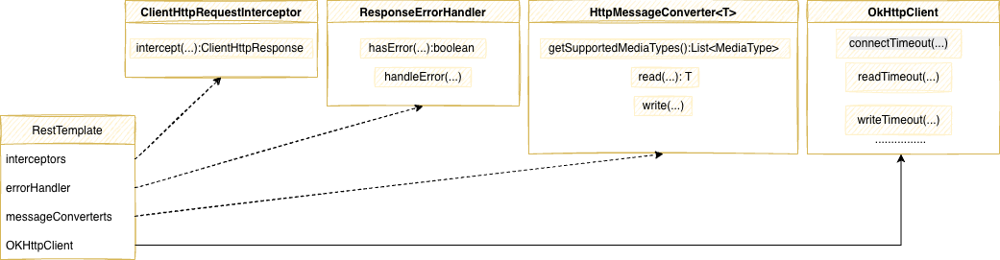
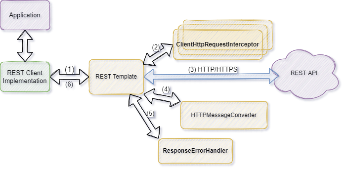

////
SPDX-License-Identifier: EUPL-1.2 OR LicenseRef-commercial
Copyright (c) 2012-2026 mgm technology partners GmbH
Dual License
This source file is part of the mgm A12 Platform and available under a choice of two different licenses:
1. Open-Source License – EUPL v1.2
You may redistribute and/or modify this file under the terms of the European Union Public License, version 1.2 - see https://eupl.eu/.
2. Commercial License
Alternatively, you may obtain a commercial license from mgm technology partners GmbH, that permits use of this software under different terms (including support and maintenance services).

Please contact a12-license@mgm-tp.com for more information.

You must select and comply with exactly one of the above license options.

Warranty Disclaimer (applies to either option)
THIS SOFTWARE IS PROVIDED “AS IS” AND WITHOUT WARRANTY OF ANY KIND, WHETHER EXPRESS OR IMPLIED, INCLUDING BUT NOT LIMITED TO THE WARRANTIES OF MERCHANTABILITY, FITNESS FOR A PARTICULAR PURPOSE AND NON-INFRINGEMENT, EXCEPT WHERE SUCH DISCLAIMERS ARE HELD TO BE LEGALLY INVALID. SEE THE RESPECTIVE LICENSE TEXT FOR DETAILS.
////
= Server Connector
Version: {version}, {date}, UAA Team
:icons: font
:source-highlighter: highlightjs
:highlightjs-theme: github
:toc: left
:toclevels: 4
:sectlinks:
:source-highlighter: coderay
:sectnums:
:sectnumlevels: 3

Server connector is a generic component for request/response server communication.

== Server Connector API

API for server connector which contains Interfaces for main connector components.

* ServerConnector
* ServerRequest
* ServerResponse

== JAVA REST Server connector

REST Server Connector is a connector implementation which uses HTTP REST as communication protocol.
The implementation uses Spring's `RestTemplte` and it's interceptor mechanism.

See class diagram for key components:

The REST Server Connector provides implementation for most commons HTTP methods:

* `RestGetConnector`
* `RestPostConnector`
* `RestPutConnector`
* `RestDeleteConnector`
* `RestOptionsConnector`
* `RestHeadConnector`

Internally it's implemented with single `GenericRestConnector` which is not made public and above classes are type wrappers.

[NOTE]
====
If there is need to create implementations for connector(s) it has to be implemented by an implementor.
==== 

The REST Server Connector behaviour can be extended from outside.
All components are illustrated in the following Class Diagram.

REST Server Connector internal architecture and flow are illustrated in the following diagram:

=== Extensions

REST Server Connector can be extended in many aspects from outside.
All extensions can be supplied to the implementation during initialization time.

==== Interceptors

Before an HTTP/HTTPS request is performed the interceptors are called.
This allows request customization.
Most common use-case is header modification.
See in following example.

[source,java]
----
public class AcceptHeaderInterceptor implements ClientHttpRequestInterceptor {

	@Override
	public ClientHttpResponse intercept(HttpRequest request, byte[] body, ClientHttpRequestExecution execution) throws IOException {
		HttpHeaders headers = request.getHeaders();
		List<MediaType> accept = headers.getAccept();
		if (accept.isEmpty()) {
			headers.setAccept(Arrays.asList(MediaType.APPLICATION_JSON));
			
		}
		return execution.execute(request, body);
	}

}
----   

==== ErrorHandler

Error handler is and implementation of the `ResponseErrorHandler`.
It can customize behaviour how the connector detects an error and what data are extracted from the server response.
REST Server Connector itself doesn't extend standard spring behaviour and uses spring `DefaultResponseErrorHandler` implementation.

==== MessageConverter

Message converter is used to convert HTTP request/response to an Object and vice versa.
Implementation is picked based on content type.
REST Server Connector uses default message converters supplied by Spring implementation.

=== Initialization

In order to use the REST Server Connector it needs to be initialized.
There is `RestServerConnectorFactoryBuilder` which builds `RestServerConnectorFactory` with all necessary extensions.
After the `RestServerConnectorFactory` is created it contains factory method for all available connectors.
After a connector is obtained from the factory it's initialized and ready to use.
The connector is intended to live for all application lifetime and there is no need to call factory multiple times.

=== SpringBoot

REST Server Connector provide SpringBoot module which introduce property based configuration.
After initialization it provides initialized connectors as spring beans to the application context.
If there is a need for extending the implementation it's enough to provide all extensions as spring beans and the module will pick them up.

See the expected extension beans injects into the spring boot configuration:

[source,java]
----
@Inject
private Optional<List<ClientHttpRequestInterceptor>> interceptors;
@Inject
private Optional<List<ResponseErrorHandler>> errorHandlers;
@Inject
private Optional<List<HttpMessageConverter<?>>> messageConvertes;
---- 

== JS Connector Client

Connector Client is a javascript library which helps you to setup, communicate to Rest Server Connector in the backend.
The library provides the setup classes and filters.

* `ServerConnector` is an interface which allows you to provide your own implementation for connect and fetch.

* `RestServerConnector` is out of the box implementation `ServerConnector` which help you to connect to the backend using REST.
During the construction of connector it's default (you can't change) that add some request and response filters.
You can add more additional request and response filters by your own.

[source,javascript]
----
const additionalRequestFilter: RequestFilter[] = [...];
const responseFilters: ResponseFilter[] = [...];
const serverConnector = new RestServerConnector(serverURL, requestFilters, responseFilters);
----

* `ConnectorLocator` will help you holds and provides access to a single instance of a `ServerConnector`

[source,javascript]
----
ConnectorLocator.createInstance(serverConnector);

const baseUrl = (ConnectorLocator.getInstance().getServerConnector() as RestServerConnector).getBaseUrl();
----

* `Filters` are the convenient ways for you to intercept the Request and Response according to your needs.

include::code_documentation.adoc[]

include::migration/index.adoc[]